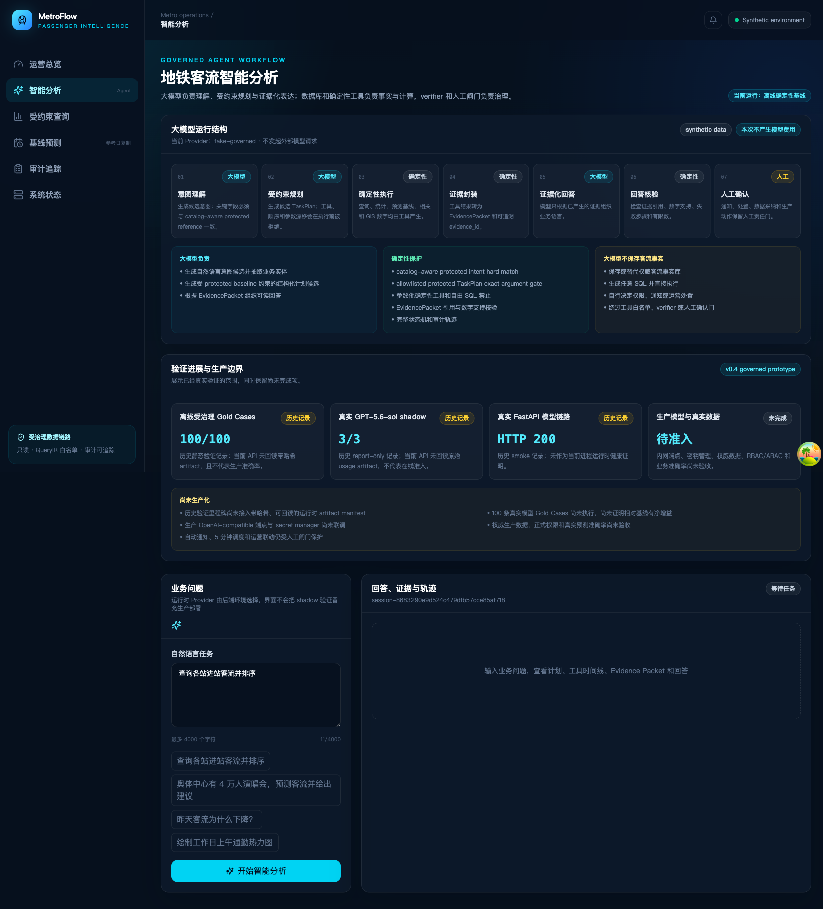

# 地铁客流智能体

本项目面向地铁运营分析，把自然语言理解、确定性计算、证据封装、结果核验和人工责任门分开治理。核心原则是：**大模型负责听懂和说明，受控后端负责查询与计算，证据包和核验器负责防止数字失真。**



## 能解决什么问题

- 用自然语言查询进站、出站、换乘、净流入等注册指标；
- 比较线路、站点、方向、时段和群体，生成排序、相关、异常与趋势结果；
- 运行参考日、活动规则和时间序列基线预测，并明确模型边界；
- 展示任务计划、工具执行、证据引用、核验状态和运行轨迹；
- 通过 Web、FastAPI、CLI 和微信客户端复用同一组受治理业务契约。

## 为什么不是“让大模型直接查库”

```text
用户问题
  → IntentEnvelope（结构化意图）
  → TaskPlan（受白名单约束的计划）
  → ToolRegistry（确定性查询/分析/预测）
  → EvidencePacket（数字与来源）
  → AssistantResponse（证据化表达）
  → Verifier（引用、数字、有限数与失败步骤核验）
```

系统不执行模型自由生成的 SQL，不把模型参数当作客流事实库，也不允许模型自行发送通知或采取运营动作。

## 当前完成度

| 能力 | 当前状态 | 证据或边界 |
| --- | --- | --- |
| 确定性 QueryIR 查询 | 已实现并自动测试 | 固定模板、参数绑定、Gold Cases、审计产物 |
| 受治理智能体工作流 | 已实现本地原型 | 意图、计划、工具、证据、核验、轨迹 |
| Web 智能分析页面 | 已实现 | 可展示回答、图表、证据、状态机与模型调用信息 |
| 离线确定性评测 | 已实现 | 当前仓库可复跑 100/100 Assistant Gold Cases |
| 真实模型适配 | 已有隔离适配器 | Hermes Codex 仅本地 shadow；OpenAI-compatible 待生产联调 |
| 生产数据与运营联动 | 未准入 | 需要权威数据、RBAC/ABAC、准确率、性能与人工审批 |

“测试通过”证明当前代码契约成立，不代表真实客流预测准确率或生产部署已经验收。

## 从哪里开始

- 第一次运行：[快速开始](quickstart_cn.md)
- 业务人员：[使用指南](user_guide_cn.md)
- 理解系统：[总体架构](architecture.md) 与 [智能体工作流](assistant_architecture.md)
- 合作开发：[项目结构](project_structure_cn.md) 与 [开发者指南](developer_guide_cn.md)
- 安全与上线：[威胁模型](threat_model.md) 与 [Web 与部署](web_and_deployment.md)
- 老板与甲方沟通：[下载 10 页中文项目说明 PPT](assets/metro-passenger-flow-agent-overview-cn.pptx)

源码仓库：[poaterjordi-netizen/passenger_flow_agent](https://github.com/poaterjordi-netizen/passenger_flow_agent)
